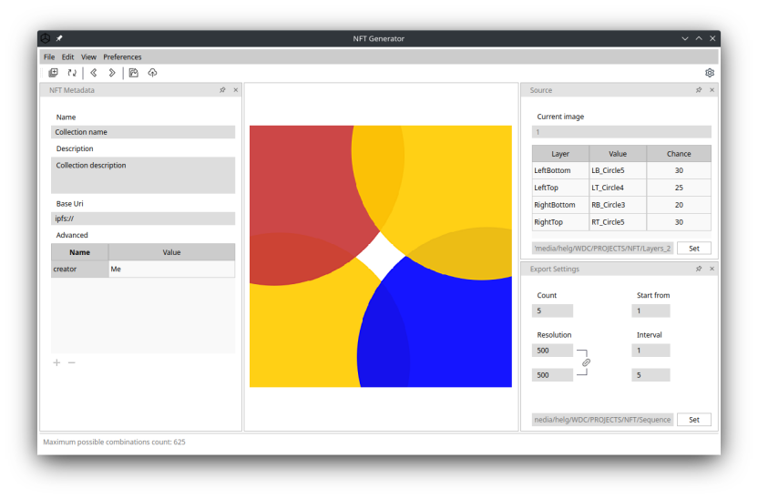

# NFT Generator

NFT Generator is an application, that allows you to create collections of images from various layers as well as the generation of metadata for the subsequent creation of an NFT collection.




### Installation

Supported operating system: Linux x86_64, Windows 8.1/10 x86_64


*ver - current version

### Buid instructions
Install dependencies:

##### - Debian 10.6 / Ubuntu 20.04 / Linux Mint 20:
    - qt5-qmake>=5.11.3
    - qtbase5-dev>=5.11.3

Buld package:

```sh
mkdir build
cd build
git clone https://github.com/CineEncoder/nft-generator.git
cd nft-generator
qmake-qt5 -o builddir/Makefile src/nft-generator.pro -spec linux-g++ CONFIG+=qtquickcompiler (or for Debian:  /usr/lib/qt5/bin/qmake -o builddir/Makefile src/nft-generator.pro -spec linux-g++)
cd builddir
make
```

### Licence

GNU GPL v.3
See [LICENSE.md](https://github.com/CineEncoder/nft-generator/blob/master/LICENSE)

### Donate

If you wish to support this project, you can make a donation $0.5 or more via PayPal. Your contributions will help keep the project alive and support future development.

[](https://paypal.me/KozhukharenkoOleg?locale.x=ru_RU)

##### Bitcoin
You can send bitcoins at this address or by scanning the QR code below:


bc1ql0f3xpj57szcnn3gzr8cwajwxj880k8j4m22qv
